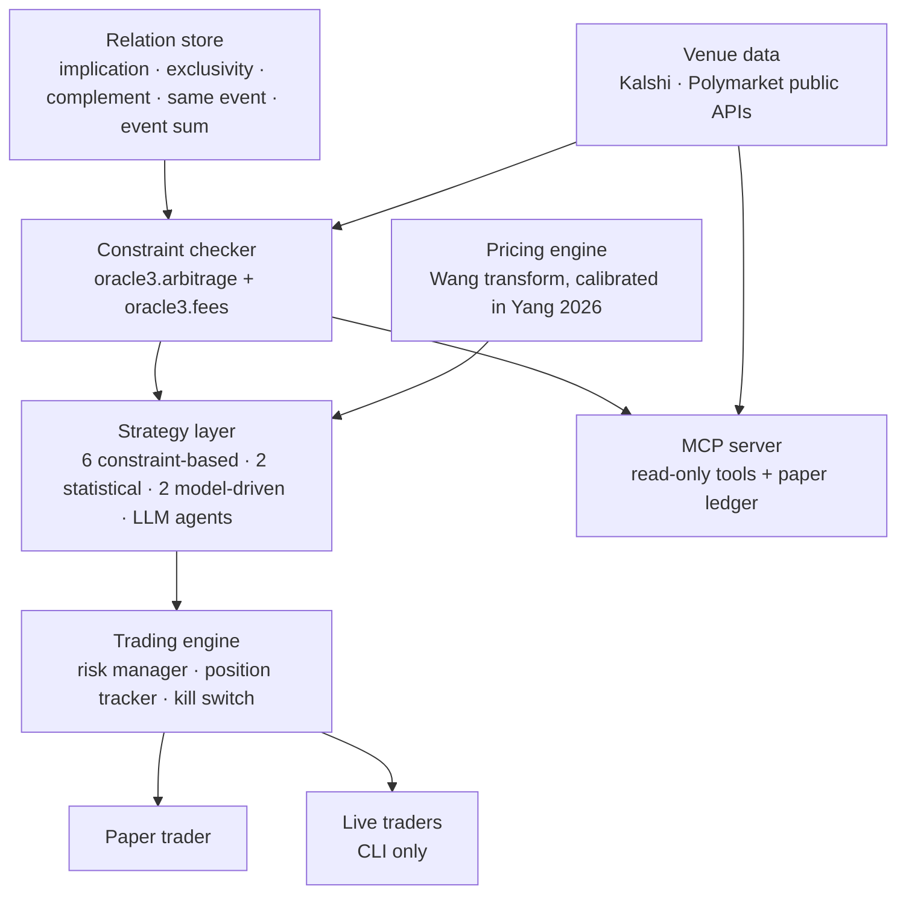

<!-- mcp-name: io.github.YichengYang-Ethan/oracle3 -->

# Oracle3

**Oracle3 is an open-source trading engine and MCP server for prediction markets.** It maps the logical relations between event contracts, finds prices that break the axioms of probability after each venue's fees, and trades them live on Kalshi, Polymarket and Solana, or on paper, under pre-trade risk limits.

[](https://github.com/YichengYang-Ethan/oracle3-prediction-market-agent/actions/workflows/pytest.yml)
[](https://pypi.org/project/oracle3/)
[](LICENSE)
[](https://doi.org/10.5281/zenodo.20062548)

> **Trades live on Kalshi, Polymarket and Solana.** `oracle3 live run` executes with the same engine that runs paper trading, behind pre-trade risk limits and a kill switch. AI agents plug in through a 13-tool MCP server.

## At a glance

| | |
|---|---|
| Venues | Kalshi, Polymarket and Solana (DFlow) |
| Execution | Live and paper on one engine, with pre-trade risk limits, a kill switch and Jito bundle submission on Solana |
| Relations checked | implication, exclusivity, complement, same event across venues, event sum |
| Costs | Each market's own fee schedule from the venue API (Kalshi taker 0.07·M·C·P·(1−P); Polymarket taker rate·C·p·(1−p)) |
| Strategies | 6 constraint-based, 2 statistical-arbitrage, 2 model-driven |
| Agent interfaces | MCP server with 13 tools, JSON CLI, 6 agent skills, Python API |
| Tests | 600+, with ruff, mypy and codespell in CI |
| Install | `pip install oracle3` |
| License | Apache-2.0; the original U Lab portions are MIT (see [NOTICE](NOTICE)) |

## What problem does it solve?

Contracts on related outcomes are tied together by probability. If A implies B, then P(A) ≤ P(B). If A and B cannot both happen, P(A) + P(B) ≤ 1. The outcomes of one event sum to one. Quoted prices break these bounds, within a venue and across venues, and a basket of contracts that pays a known amount in every state can then be bought for less than that amount.

The gaps are small, and both venues charge taker fees that scale with p(1 − p). Whether a gap is worth anything depends on the fee on every leg of the basket. Oracle3 does three things with that:

1. **Relations.** It records which markets are related and how (implication, exclusivity, complement, same event, event sum).
2. **Checks.** For each relation it finds the cheapest basket at executable prices, prices every leg under that market's own fee schedule, and reports the edge before and after fees.
3. **Execution.** It trades the baskets that survive, live or on paper, under position, drawdown and exposure limits, with a kill switch.

## How do I run it?

```bash
pip install oracle3

# Find markets (JSON output for scripts and agents)
oracle3 market search --exchange kalshi --query "fed" --json
oracle3 market search --exchange polymarket --query "fed decision" --json

# Start the MCP server over stdio
oracle3 mcp

# Trade live on Kalshi (key via KALSHI_API_KEY_ID and KALSHI_PRIVATE_KEY_PATH)
oracle3 live run --exchange kalshi --monitor \
  --strategy-ref oracle3.strategy.contrib.implication_arb_strategy:ImplicationArbStrategy
```

From Python:

```python
from oracle3.arbitrage import Quote, check_constraint
from oracle3.fees import KalshiSchedule

# A implies B, but A is bid at 0.60 while B is offered at 0.55.
result = check_constraint(
    "implication",
    [Quote("A", yes_bid=0.60, schedule=KalshiSchedule()),
     Quote("B", yes_ask=0.55, schedule=KalshiSchedule())],
)
best = result.best
print(best.description, best.gross_edge, best.fees, best.net_edge)
# NO on A + YES on B 0.05 0.0342 0.0158
```

Full CLI reference: [documentation](https://yichengyang-ethan.github.io/oracle3-prediction-market-agent/).

## How do AI agents use it?

### MCP server

Add it to any MCP client. For Claude Code:

```bash
claude mcp add oracle3 -- uvx oracle3 mcp
```

For Claude Desktop, Cursor and other clients that read an `mcpServers` block:

```json
{
  "mcpServers": {
    "oracle3": { "command": "uvx", "args": ["oracle3", "mcp"] }
  }
}
```

| Tool | What it does | Side effects |
|---|---|---|
| `search_markets` | Keyword search on Kalshi or Polymarket; Kalshi series listing | read-only |
| `get_market` | Prices, volume, close time and resolution rules | read-only |
| `get_orderbook` | Both sides of the book, best level first | read-only |
| `get_quote` | Best bid and ask on YES and NO, with the market's fee schedule | read-only |
| `check_constraint_live` | Fetch quotes and fee schedules, then check a relation | read-only |
| `check_constraint` | Check a relation on quotes you supply | none |
| `trading_fee` | Fee for one fill under a venue schedule | none |
| `fair_value` | Probability implied by a price under the Wang transform | none |
| `list_relation_types` | The supported relations and their bounds | none |
| `list_relations` | Relations saved locally by the research CLI | reads a local file |
| `paper_order` | Buy in a local paper ledger, filling against the live book with fees | writes a local file |
| `paper_portfolio` | Cash, positions and fills in the paper ledger | reads a local file |
| `paper_reset` | Erase the paper ledger (requires `confirm=true`) | writes a local file |

Real-money execution stays in the CLI: agents research and paper-trade through MCP, and a human signs off on live orders.

To execute on Polymarket without giving oracle3 a private key, [oracle3-extras](https://github.com/YichengYang-Ethan/oracle3-extras) routes orders through MetaMask Agent Wallet (testnet by default).

If your client ran oracle3 1.2.0, which failed to start with mcp 2.x, refresh uv's cached copy once with `uvx --refresh oracle3 mcp`.

### Agent skills

[`skills/`](skills/) (mirrored in `.claude/skills/` for Claude Code) holds step-by-step instructions for agents:

| Skill | Use it to |
|---|---|
| `pm-constraint-arbitrage` | Check related markets for a fee-surviving violation with the MCP tools |
| `pm-data-discovery` | Find markets and save research samples |
| `pm-quant-strategy-authoring` | Write a tunable `QuantStrategy` |
| `pm-agent-strategy-authoring` | Write an LLM- or tool-driven `AgentStrategy` |
| `pm-paper-trade-ops` | Run, monitor and archive paper trading |
| `pm-live-trade-ops` | Live trading, only with explicit user approval |

### JSON CLI

Every `market`, `paper` and `trade` command, and every `research` command except `research memory`, accepts `--json`. A running engine can be paused, resumed, inspected and stopped from another process with `oracle3 trade pause|resume|state|stop --json`. See [AGENTS.md](AGENTS.md) for which commands are read-only.

## What do fees do to the edge?

Both venues charge taker fees proportional to p(1 − p). A two-leg taker basket with both legs near 0.50 has to clear these violations per contract before any edge is left:

| Venues | Break-even violation |
|---|---:|
| Kalshi + Kalshi | 3.50¢ |
| Kalshi + Polymarket (rate 0.05) | 3.00¢ |
| Kalshi + Polymarket (rate 0.04) | 2.75¢ |
| Polymarket + Polymarket (rate 0.04) | 2.00¢ |

Buying every outcome of an n-way event costs k(1 − Σp²) per contract, which approaches 7¢ on Kalshi as outcomes multiply. The derivation, the tables and the sources are in [Do prediction-market arbitrage edges survive fees?](docs/research/fee-frontier.md); `python scripts/fee_frontier.py` reproduces every number.

## How is it tested?

- `oracle3.fees` reproduces Kalshi's published fee table and Polymarket's documented fee example.
- `oracle3.arbitrage` is unit-tested for every relation, including mixed-venue baskets and missing quotes.
- The MCP server is tested against mocked venue APIs, run against the live public APIs, and checked in CI on both major versions of the MCP SDK.
- The pricing engine uses the coefficients from the companion working paper ([SSRN 6468338](https://papers.ssrn.com/sol3/papers.cfm?abstract_id=6468338)), checked against its [replication package](https://github.com/YichengYang-Ethan/prediction-market-pricing).

## Roadmap

1. Price every strategy signal with the venue fee schedules in `oracle3.fees`.
2. Measure how often and how deeply live violations clear the fee hurdle, per relation and venue pair.
3. Wire `SpreadExecutor`, multi-leg execution with LIFO unwind on partial fills, into the multi-leg strategies.
4. Publish a pre-registered forward track record with timestamped daily snapshots.

## How is it built?



Relations and venue quotes feed the constraint checker, which prices every basket under each market's fee schedule. Strategies consume those checks and the pricing engine's fair values and send orders through a trading engine that enforces risk limits. The MCP server exposes the data, the checker and a separate paper ledger to agents; live traders are reachable only from the CLI.

**Constraint-based strategies**, each enforcing one probability bound:

| Strategy | Bound |
|---|---|
| Cross-market | Same event, same price across venues |
| Exclusivity | P(A) + P(B) ≤ 1 for mutually exclusive events |
| Implication | P(A) ≤ P(B) when A implies B |
| Conditional | P(A \| B) within derived bounds |
| Event sum | Σ P(outcome) = 1 within an event |
| Structural | P(A) = β·P(B) + α from a fitted relation |

**Statistical arbitrage:** cointegration spread, lead-lag. **Model-driven:** fair-value divergence and premium decay, using the pricing model below.

**Pricing model.** Fair values come from the Wang transform p_mkt = Φ(Φ⁻¹(p) + λ), with λ estimated on 291,309 resolved contracts in the companion working paper, Yang (2026), *Pricing Prediction Markets: Incomplete Markets, Selection Rules, and Calibration Wedges* ([SSRN 6468338](https://papers.ssrn.com/sol3/papers.cfm?abstract_id=6468338)). The model and its estimates are documented there.

## Related projects

- [ulab-uiuc/prediction-market-cli](https://github.com/ulab-uiuc/prediction-market-cli) (Coinjure): agent-native trading system for prediction markets; Oracle3 bundles its `coinjure` package.
- [pmxt-dev/pmxt](https://github.com/pmxt-dev/pmxt): unified API across prediction-market venues.
- [Jon-Becker/prediction-market-analysis](https://github.com/Jon-Becker/prediction-market-analysis): data collection and analysis framework with a large public dataset.
- [YichengYang-Ethan/prediction-market-pricing](https://github.com/YichengYang-Ethan/prediction-market-pricing): replication package for the pricing model.

## How can I collaborate?

- **Open problems** are tracked as [issues labeled `open-problem`](https://github.com/YichengYang-Ethan/oracle3-prediction-market-agent/issues?q=is%3Aissue+label%3Aopen-problem): measuring violations against the fee hurdle, evaluating relation discovery, and comparing LLM and market calibration.
- **Discussions** are open for questions and ideas: [GitHub Discussions](https://github.com/YichengYang-Ethan/oracle3-prediction-market-agent/discussions).
- **Contributions:** see [CONTRIBUTING.md](.github/CONTRIBUTING.md).

## How do I cite it?

Citation metadata is in [CITATION.cff](CITATION.cff), and every release is archived on Zenodo ([DOI 10.5281/zenodo.20062548](https://doi.org/10.5281/zenodo.20062548)). For the pricing model, cite the working paper ([SSRN 6468338](https://papers.ssrn.com/sol3/papers.cfm?abstract_id=6468338)).

## Origin and attribution

Oracle3 began as `ulab-uiuc/oracle3`, developed by Yicheng Yang and Haofei Yu at U Lab (University of Illinois Urbana-Champaign) under the MIT License, and it bundles the [`coinjure`](https://github.com/ulab-uiuc/prediction-market-cli) package from the same lab. The strategy, pricing, risk, dashboard, and test layers in this repository were added on top of that base; see [NOTICE](NOTICE) for the retained license text.

## License

Apache 2.0; see [LICENSE](LICENSE). Portions from the original U Lab code remain under the MIT License reproduced in [NOTICE](NOTICE).

*This software is for research and education. Trading involves financial risk.*
